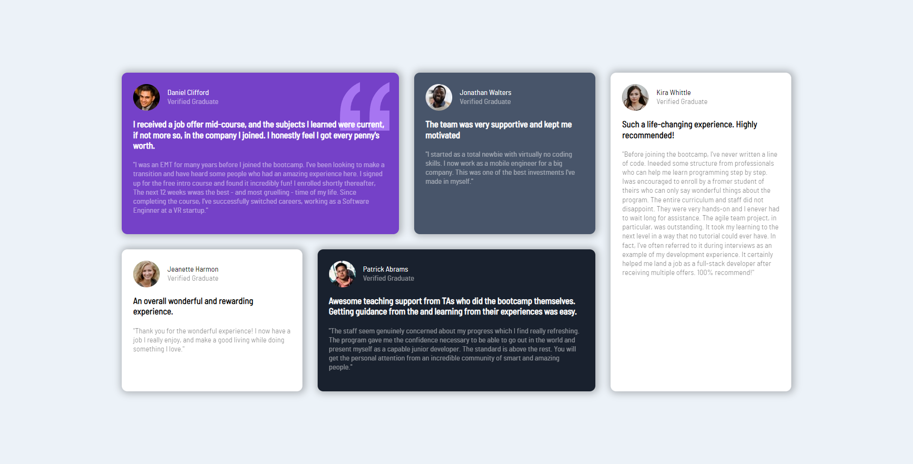

# Frontend Mentor - Testimonials grid section solution

This is a solution to the [Testimonials grid section challenge on Frontend Mentor](https://www.frontendmentor.io/challenges/testimonials-grid-section-Nnw6J7Un7). 

## Table of contents

- [Overview](#overview)
  - [The challenge](#the-challenge)
  - [Screenshot](#screenshot)
  - [Links](#links)
- [My process](#my-process)
  - [Built with](#built-with)
  - [What I learned](#what-i-learned)
  - [Useful resources](#useful-resources)
- [Author](#author)

## Overview

### The challenge

Users should be able to:

- View the optimal layout for the site depending on their device's screen size

### Screenshot

### Links

- Live Site URL:(https://kmarsic.github.io/testimonials-grid-section/)

## My process

### Built with

- Semantic HTML5 markup
- CSS custom properties
- CSS Grid
- Mobile-first workflow

### What I learned

Freshened up my knowledge on the grid-template-areas property and found it to be the easiest thing to use to achieve a complex layout such as this.

### Useful resources

- (https://www.https://developer.mozilla.org/en-US/docs/Web/CSS/grid-template-areas.com) - This article helped me better understand how to properly use the afore-mentioned property.

## Author
Frontend Mentor - (https://www.frontendmentor.io/profile/kmarsic)
LinkedIn - (https://www.linkedin.com/in/kristijan-mar%C5%A1i%C4%87-300447277/))

